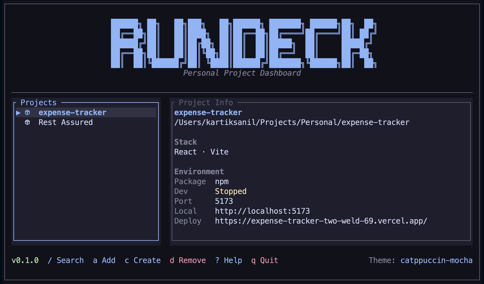
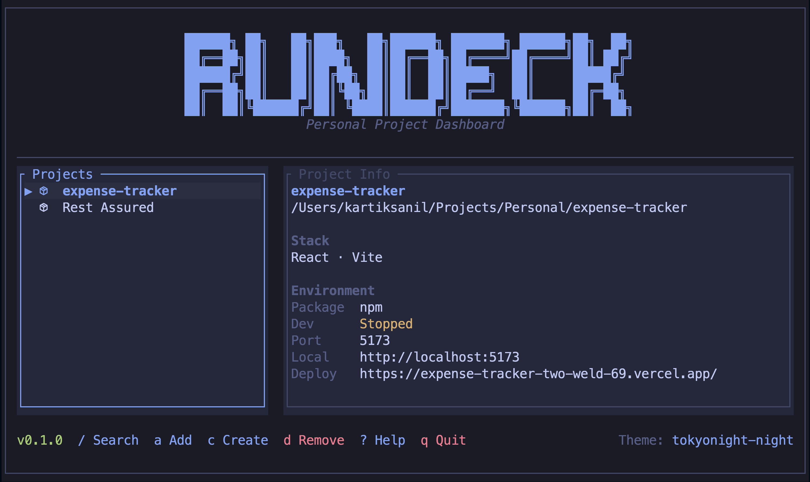
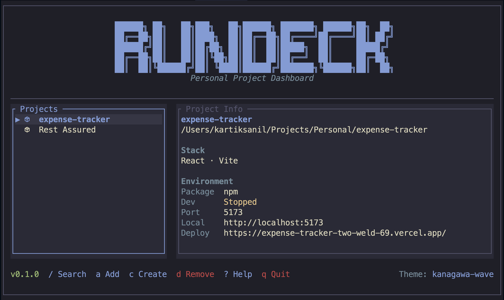
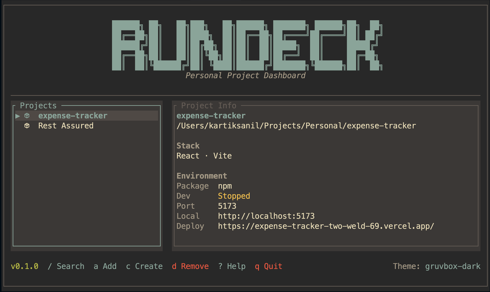
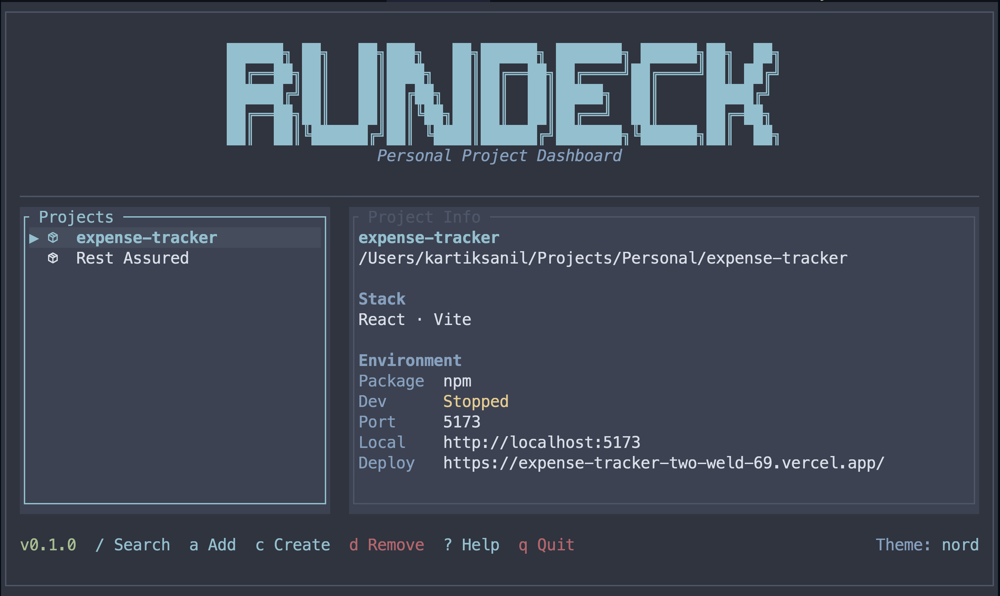
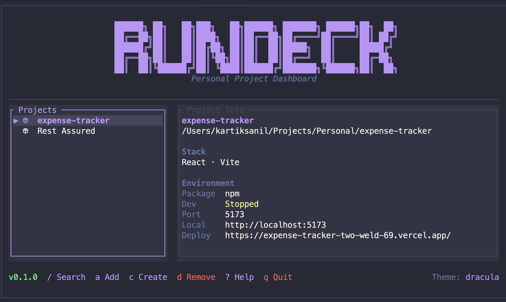

# RunDeck

RunDeck is a fast terminal dashboard for managing personal development projects.

It helps you open project workspaces, tmux sessions, Neovim, lazygit, local previews, deploy links, and project metadata from one clean terminal UI.



## Why RunDeck?

Most developers keep switching between:

- terminal folders
- tmux sessions
- Neovim
- lazygit
- localhost URLs
- deploy links
- project notes/configs

RunDeck brings all of that into one keyboard-driven dashboard.

## Features

- Terminal dashboard built in Rust
- Project launcher with tmux + Neovim workspace
- Automatic stack detection
- Local preview launcher
- Deploy URL launcher
- lazygit shortcut
- Add existing projects with fzf
- Create new projects from the dashboard
- Remove projects from RunDeck without deleting folders
- Auto-removes missing projects when folders are deleted
- Configurable keymaps
- Multiple themes
- Optional Neovim/LazyVim companion plugin
- Works great with custom dotfiles, tmux layouts, and terminal-first workflows

## Installation

### Quick install

```bash
curl -fsSL https://raw.githubusercontent.com/IntScription/rundeck/main/scripts/install.sh | bash
```

If `rundeck` is not found after installing, add Cargo/local binaries to your shell path:

```bash
export PATH="$HOME/.cargo/bin:$HOME/.local/bin:$PATH"
```

For zsh:

```bash
echo 'export PATH="$HOME/.cargo/bin:$HOME/.local/bin:$PATH"' >> ~/.zshrc
source ~/.zshrc
```

## Install by platform

### macOS

Using Homebrew:

```bash
brew install IntScription/rundeck/rundeck
```

Or tap first:

```bash
brew tap IntScription/rundeck
brew install rundeck
```

Using the install script:

```bash
curl -fsSL https://raw.githubusercontent.com/IntScription/rundeck/main/scripts/install.sh | bash
```

From source:

```bash
cargo install --git https://github.com/IntScription/rundeck --force
```

### Linux

Using the universal install script:

```bash
curl -fsSL https://raw.githubusercontent.com/IntScription/rundeck/main/scripts/install.sh | bash
```

Using Homebrew on Linux:

```bash
brew install IntScription/rundeck/rundeck
```

From source:

```bash
cargo install --git https://github.com/IntScription/rundeck --force
```

From a local clone:

```bash
git clone https://github.com/IntScription/rundeck.git
cd rundeck
cargo install --path . --force
```

#### Linux package-manager notes

RunDeck can be distributed to Linux users in multiple package formats. Use the package that matches your distro once release artifacts are available.

Ubuntu / Debian:

```bash
sudo apt install ./rundeck-linux-amd64.deb
```

Fedora / RHEL:

```bash
sudo dnf install ./rundeck-linux-x86_64.rpm
```

Arch Linux / Manjaro:

```bash
sudo pacman -U rundeck-linux-x86_64.pkg.tar.zst
```

If an AUR package is published later:

```bash
yay -S rundeck
```

### Windows

RunDeck is designed around terminal tools like tmux, Neovim, lazygit, and local project folders. On Windows, WSL2 is recommended for the best experience.

#### Windows with WSL2 recommended

Inside your WSL terminal:

```bash
curl -fsSL https://raw.githubusercontent.com/IntScription/rundeck/main/scripts/install.sh | bash
```

Then run:

```bash
rundeck
```

#### Native Windows from source

Install Rust, Git, and Neovim, then run:

```powershell
cargo install --git https://github.com/IntScription/rundeck --force
```

If you add a PowerShell installer later, you can expose it like this:

```powershell
irm https://raw.githubusercontent.com/IntScription/rundeck/main/scripts/install.ps1 | iex
```

### Docker

Docker support is mainly for development, testing, and container users. RunDeck is designed to run directly on the host because it integrates with tmux, Neovim, local folders, browser URLs, and user config.

Pull from GitHub Container Registry if the image is published:

```bash
docker pull ghcr.io/intscription/rundeck:latest
```

Run doctor:

```bash
docker run --rm ghcr.io/intscription/rundeck:latest doctor
```

Build locally:

```bash
docker build -t rundeck:local .
```

Run doctor locally:

```bash
docker run --rm rundeck:local doctor
```

Open a container shell:

```bash
docker compose run --rm shell
```

## Requirements

RunDeck works best with:

- tmux
- git
- fzf
- lazygit
- Neovim
- LazyVim optional, but recommended for the full terminal IDE workflow

### macOS tools

```bash
brew install tmux lazygit fzf neovim ripgrep fd
```

### Linux tools

Ubuntu / Debian:

```bash
sudo apt update
sudo apt install -y git tmux fzf neovim ripgrep fd-find curl build-essential
```

Fedora:

```bash
sudo dnf install -y git tmux fzf neovim ripgrep fd-find curl gcc gcc-c++ make
```

Arch Linux / Manjaro:

```bash
sudo pacman -S git tmux fzf neovim ripgrep fd curl base-devel
```

Install lazygit using your distro package manager, Homebrew on Linux, or the official lazygit release package.

### Windows tools

For the smoothest setup, install these inside WSL2 using the Linux commands above.

For native Windows, use Windows Terminal plus your preferred package manager:

```powershell
winget install Git.Git Neovim.Neovim Rustlang.Rustup
```

Check your setup:

```bash
rundeck doctor
```

## LazyVim setup

LazyVim is optional, but it pairs well with RunDeck because RunDeck can launch project workspaces directly into Neovim.

### Install LazyVim starter

Back up any existing Neovim config first:

```bash
mv ~/.config/nvim{,.bak}
mv ~/.local/share/nvim{,.bak}
mv ~/.local/state/nvim{,.bak}
mv ~/.cache/nvim{,.bak}
```

Clone the LazyVim starter:

```bash
git clone https://github.com/LazyVim/starter ~/.config/nvim
rm -rf ~/.config/nvim/.git
nvim
```

After opening Neovim, run:

```vim
:LazyHealth
```

### Use my dotfiles

If you want the same terminal-first setup with LazyVim, tmux, Alacritty, and related configs, you can use my dotfiles:

```bash
git clone https://github.com/IntScription/dotfiles ~/.dotfiles
cd ~/.dotfiles
./install.sh
```

Or manually stow only the configs you want:

```bash
cd ~/.dotfiles
stow nvim tmux alacritty
```

The dotfiles repo is useful if you want a ready-to-use LazyVim and tmux workflow that matches the way RunDeck is intended to be used.

## Usage

Open the dashboard:

```bash
rundeck
```

Run diagnostics:

```bash
rundeck doctor
```

Add a project manually:

```bash
rundeck add ~/Projects/my-app --name "My App" --port 3000
```

Add a deploy URL:

```bash
rundeck add ~/Projects/my-app \
  --name "My App" \
  --port 3000 \
  --url "https://my-app.vercel.app"
```

## Dashboard Keymaps

Default keymaps:

| Key | Action |
|---|---|
| `Enter` | Open project tmux workspace |
| `a` | Add existing project |
| `c` | Create new project |
| `d` | Remove project from RunDeck only |
| `b` | Start/open local preview |
| `B` | Open deployed preview |
| `g` | Open lazygit |
| `u` | Edit deploy URL |
| `e` | Edit RunDeck config |
| `T` | Theme picker |
| `D` | Doctor |
| `/` | Search projects |
| `?` | Help / commands |
| `q` | Quit |
| `h/l` | Switch focus |
| `j/k` | Move or scroll |

Removing a project with `d` only removes it from RunDeck config. It does not delete the actual project folder.

## tmux Workspace

Pressing `Enter` opens a tmux workspace for the selected project.

By default:

- Top pane opens your editor
- Bottom pane opens a shell
- The bottom pane shows useful RunDeck commands

Inside a project tmux session:

```bash
rundeck back
```

Return to RunDeck.

```bash
rundeck close
```

Return to RunDeck and close the current project session.

```bash
rundeck kill
```

Kill the current tmux session.

## Local Preview

Press `b` to start the project dev server and open localhost.

RunDeck detects common dev servers:

- Next.js → `3000`
- Vite → `5173`
- Expo → `8081`

For custom setups, edit config:

```toml
[[projects]]
name = "My App"
path = "/Users/me/Projects/my-app"
port = 3000
dev_command = "cd web && npm run dev"
```

## Monorepo / Workspace Support

RunDeck supports projects like:

```txt
my-project/
├─ web/
│  └─ package.json
├─ mobile/
│  └─ package.json
└─ supabase/
```

It shows one project in the dashboard:

```txt
My Project
```

The stack detector reads from root, `web`, `mobile`, `apps`, `packages`, Supabase, Tauri, Rust, Python, Go, and other common project markers.

Example detected stack:

```txt
Next.js · React · TypeScript · Tailwind · Expo · React Native · Supabase
```

## Config

Config lives here:

```txt
~/.config/rundeck/config.toml
```

Open it from RunDeck with:

```txt
e
```

Example config:

```toml
editor = "nvim"
shell = "/bin/zsh"
theme = "catppuccin-mocha"
top_pane_ratio = 70
show_icons = true
project_picker = "fzf"
project_roots = ["~/Projects", "~/Developer"]

[keymaps]
quit = "q"
help = "?"
search = "/"
add_project = "a"
create_project = "c"
remove_project = "d"
workspace = "enter"
workspace_alt = "t"
local_preview = "b"
deploy_preview = "B"
editor = "o"
lazygit = "g"
edit_deploy = "u"
config = "e"
theme = "T"
doctor = "D"
kill_session = "x"
stop_dev = "X"
reload = "r"
left = "h"
right = "l"
down = "j"
up = "k"
```

## Homebrew Tap

RunDeck uses a separate Homebrew tap repository:

```txt
IntScription/homebrew-rundeck
```

That repository contains the Homebrew formula used by:

```bash
brew install IntScription/rundeck/rundeck
```

Or tap first:

```bash
brew tap IntScription/rundeck
brew install rundeck
```

The main repository contains the Rust source code. The Homebrew tap only contains the install recipe.

## Themes

RunDeck ships with multiple terminal-friendly themes. The main screenshot at the top of this README uses the **Catppuccin Mocha** theme.

Open the theme picker from the dashboard:

```txt
T
```

Then press `Enter` to apply the selected theme, or `q` to close the picker.

You can also set a theme manually in `~/.config/rundeck/config.toml`:

```toml
theme = "catppuccin-mocha"
```

Available theme values:

```txt
catppuccin-mocha
tokyo-night
kanagawa-wave
gruvbox-dark
rose-pine
nord
dracula
```

### Theme gallery

The gallery expects the screenshots to be stored in the `assets/` folder with these filenames: `catppuccin-mocha.png`, `tokyonight.png`, `kanagawa-wave.png`, `gruvbox-dark.png`, `rose-pine.png`, `nord.png`, and `dracula.png`.

<table>
  <tr>
    <td width="50%" align="center" valign="top">
      <strong>Catppuccin Mocha</strong><br />
      
    </td>
    <td width="50%" align="center" valign="top">
      <strong>Tokyo Night</strong><br />
      
    </td>
  </tr>
  <tr>
    <td width="50%" align="center" valign="top">
      <strong>Kanagawa Wave</strong><br />
      
    </td>
    <td width="50%" align="center" valign="top">
      <strong>Gruvbox Dark</strong><br />
      
    </td>
  </tr>
  <tr>
    <td width="50%" align="center" valign="top">
      <strong>Rose Pine</strong><br />
      
    </td>
    <td width="50%" align="center" valign="top">
      <strong>Nord</strong><br />
      
    </td>
  </tr>
  <tr>
    <td width="50%" align="center" valign="top">
      <strong>Dracula</strong><br />
      
    </td>
    <td width="50%" valign="top"></td>
  </tr>
</table>

## Optional Neovim / LazyVim Plugin

RunDeck includes an optional Neovim helper plugin.

Folder:

```txt
nvim/lua/rundeck.lua
```

LazyVim plugin setup:

```lua
return {
  dir = "~/Projects/Personal/rundeck/nvim",
  name = "rundeck.nvim",
  lazy = false,
  config = function()
    require("rundeck").setup({
      keymaps = {
        open = "<leader>rd",
        add = "<leader>ra",
        create = "<leader>rc",
        config = "<leader>re",
      },
    })
  end,
}
```

Commands:

```vim
:Rundeck
:RundeckAdd
:RundeckCreate
:RundeckConfig
```

Default keymaps:

| Keymap | Action |
|---|---|
| `<leader>rd` | Open RunDeck dashboard |
| `<leader>ra` | Add current Neovim project to RunDeck |
| `<leader>rc` | Open create project helper |
| `<leader>re` | Edit RunDeck config |

## Kubernetes

Kubernetes support is provided as example manifests for running RunDeck as a toolbox/job container.

Apply:

```bash
kubectl apply -f k8s/namespace.yaml
kubectl apply -f k8s/configmap.yaml
kubectl apply -f k8s/job.yaml
```

View doctor output:

```bash
kubectl logs -n rundeck job/rundeck-doctor
```

Run toolbox pod:

```bash
kubectl apply -f k8s/toolbox-pod.yaml
kubectl exec -n rundeck -it rundeck-toolbox -- zsh
```

Clean up:

```bash
kubectl delete namespace rundeck
```
