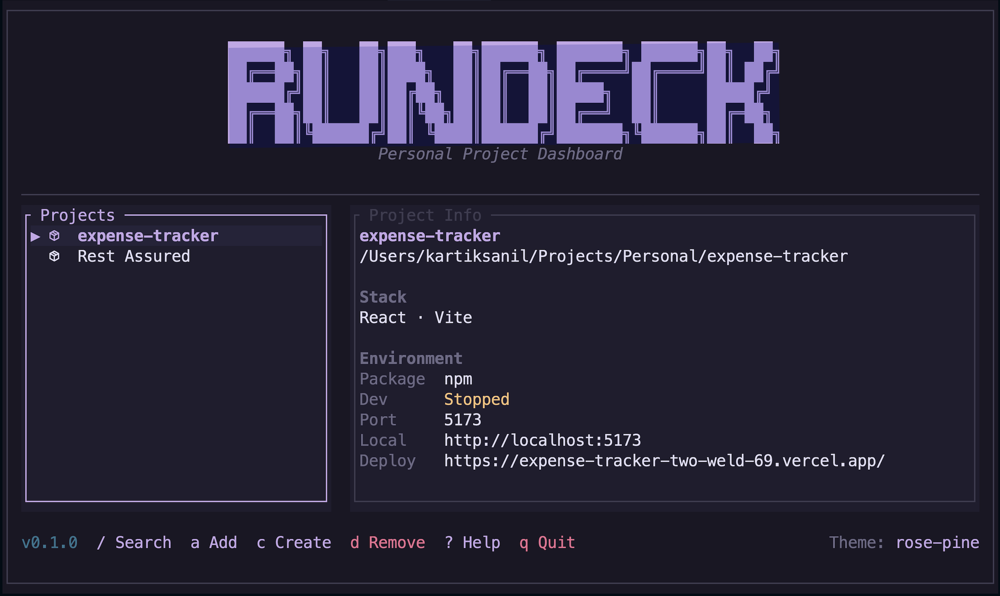

# RunDeck

RunDeck is a fast terminal dashboard for managing personal development projects.

It helps you open project workspaces, tmux sessions, Neovim, lazygit, local previews, deploy links, and project metadata from one clean terminal UI.



## Why RunDeck?

Most developers keep switching between:

- terminal folders
- tmux sessions
- Neovim
- lazygit
- localhost URLs
- deploy links
- project notes/configs

RunDeck brings all of that into one keyboard-driven dashboard.

## Features

- Terminal dashboard built in Rust
- Project launcher with tmux + Neovim workspace
- Automatic stack detection
- Local preview launcher
- Deploy URL launcher
- lazygit shortcut
- Add existing projects with fzf
- Create new projects from the dashboard
- Remove projects from RunDeck without deleting folders
- Auto-removes missing projects when folders are deleted
- Configurable keymaps
- Multiple themes
- Optional Neovim/LazyVim companion plugin

## Installation

### Requirements

RunDeck works best with:

- Rust / Cargo
- tmux
- git
- fzf
- lazygit
- Neovim

On macOS:

```bash
brew install tmux lazygit fzf
